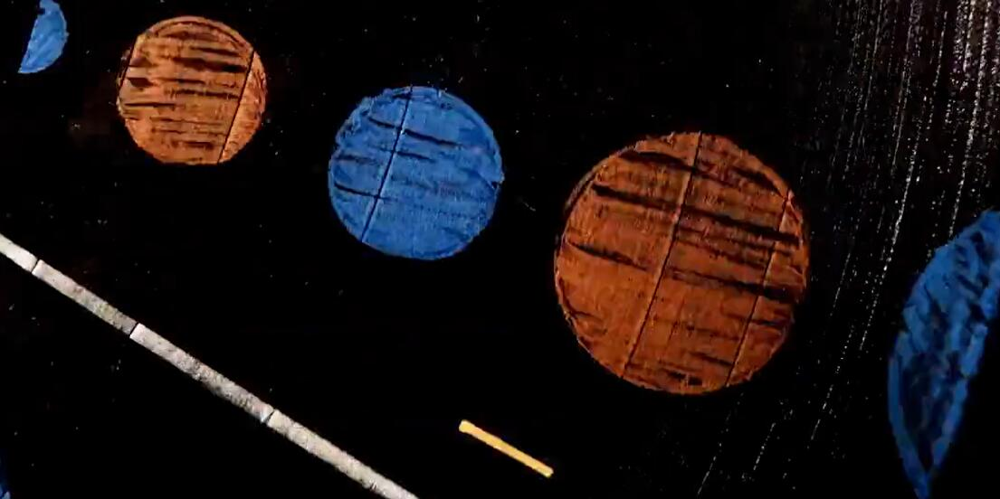
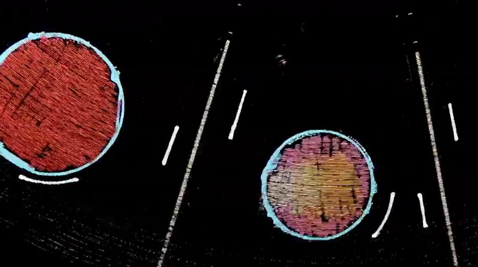
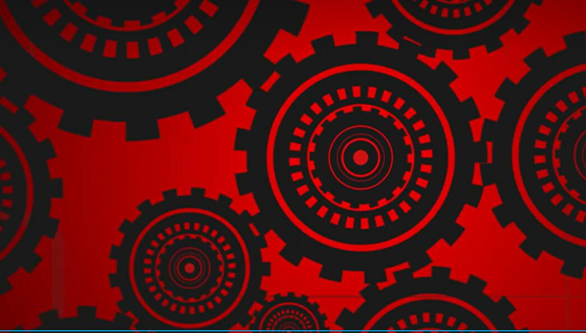

# Quiz8

__Part1__ 

In the major assessment, I choose the painting 'Wheels of fortune' from Pacita Abad.

Wheels are related to other circle-shape object, and I was inspired by the animation of gearwheels and the drawing animation on the disk. Firstly wheels of forture looks similar of colorful disk and all of the close were very closed to each other, which inspired my to consider if the fortune wheels could rotate with the rhythm of music with the movement of the curve next to them. 


Therefore, this famour painting could turn into an voice-controlled animation that makes a abstract painting vivid and attractive.


__Part2__ 
In order to rotate the wheel of fortune,  the "rotate" directive in p5.js can be used to keep the circle rotating. In addition, in the ‘Wheel of Fortune’, each circle is a concentric circle made up of several circles, based on which you can make the same circle rotate at different speeds to achieve more diversified effects, which is close to the principle of disc rotation. 
`inline code`
```
let angle = 0.0;
let jitter = 0.0;

function setup() {
  createCanvas(720, 400);
  noStroke();
  fill(255);
  //Draw the rectangle from the center and it will also be the
  //rotate around that center
  rectMode(CENTER);
}

function draw() {
  background(51);

  // during even-numbered seconds (0, 2, 4, 6...) add jitter to
  // the rotation
  if (second() % 2 === 0) {
    jitter = random(-0.1, 0.1);
  }
  //increase the angle value using the most recent jitter value
  angle = angle + jitter;
  //use cosine to get a smooth CW and CCW motion when not jittering
  let c = cos(angle);
  //move the shape to the center of the canvas
  translate(width / 2, height / 2);
  //apply the final rotation
  rotate(c);
  rect(0, 0, 180, 180);
}

```


Similarly, maintaining different rotational efficiencies for each circle on the image with the same rhythm will contribute to the vividness of the picture.