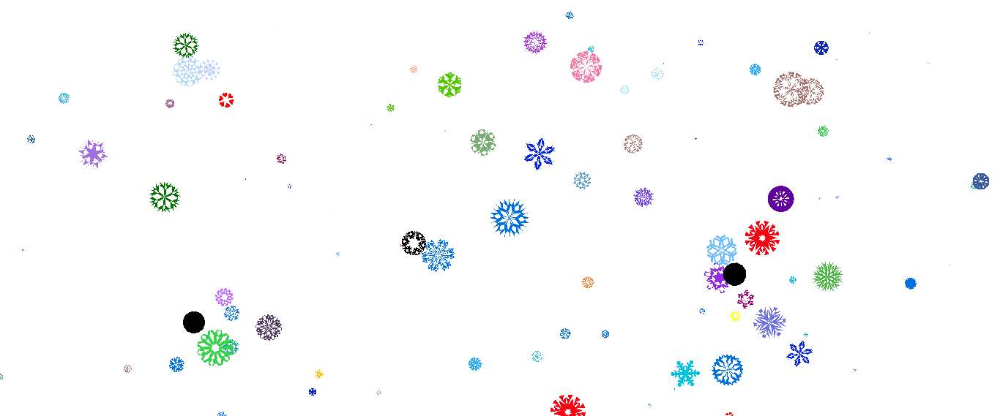
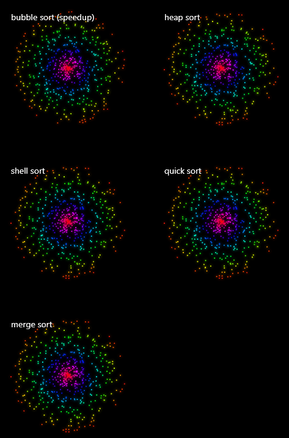

# Quiz8

__Part1__ 

In the major assessment, I choose the painting 'Wheels of fortune' from Pacita Abad.

Wheels are related to other circle-shape object, and I was inspired by the animation of gearwheels and the drawing animation on the disk. Firstly wheels of forture looks similar of colorful disk and all of the close were very closed to each other, which inspired my to consider if the fortune wheels could rotate with the movement of the curve next to them, and then those circle expanded and go away. 

Therefore, this famour painting could turn into an voice-controlled animation that makes a abstract painting vivid and attractive.

__Part2__ 

In order to rotate the wheel of fortune,  the "rotate" directive in p5.js can be used to keep the circle rotating. In addition, in the ‘Wheel of Fortune’, each circle is a concentric circle made up of several circles, based on which you can make the same circle rotate at different speeds to achieve more diversified effects, which is close to the principle of disc rotation. 

[The example of rotate](https://p5js.org/examples/transform-rotate.html)

[The data of rotating circle](https://editor.p5js.org/jcponce/sketches/tA94Ptb-f)

Similarly, maintaining different rotational efficiencies for each circle on the image will contribute to the vividness of the picture.

